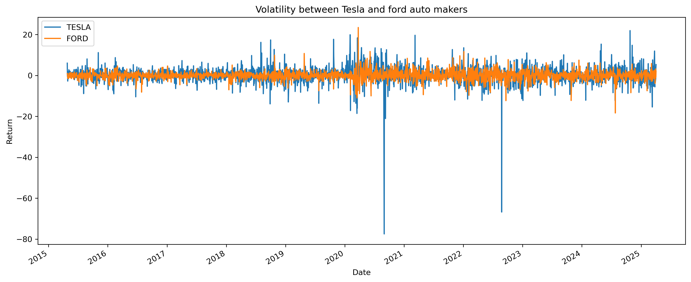
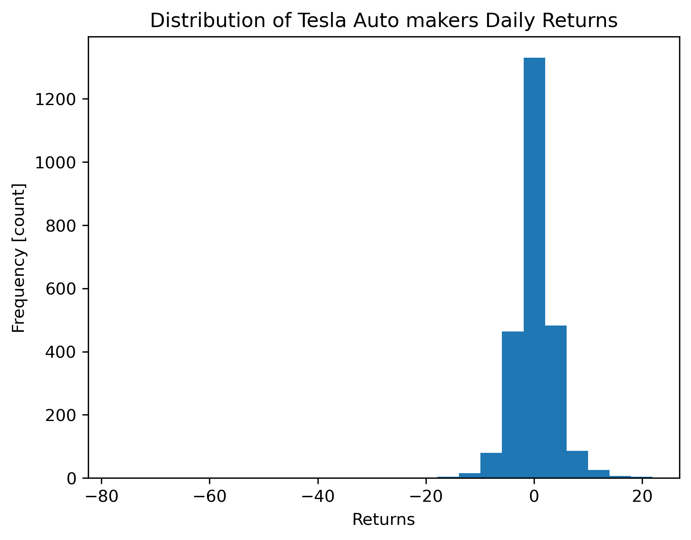
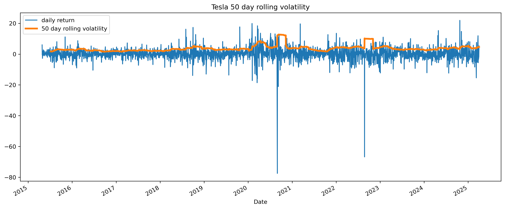
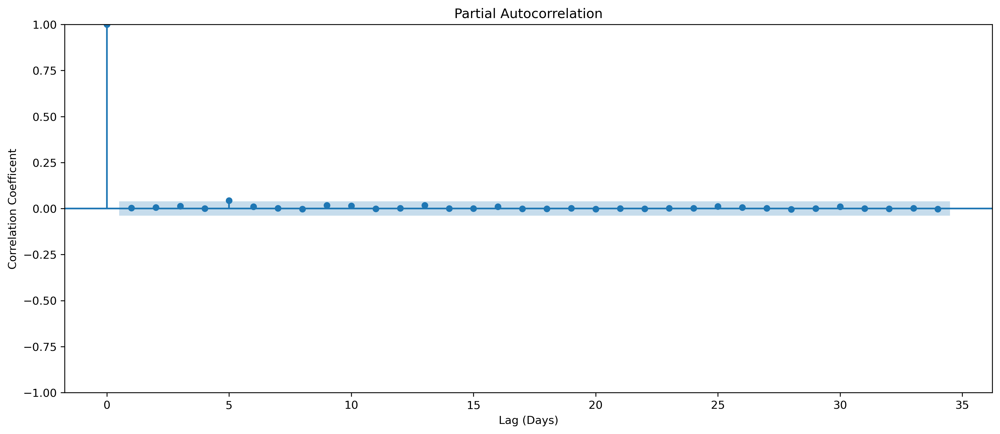
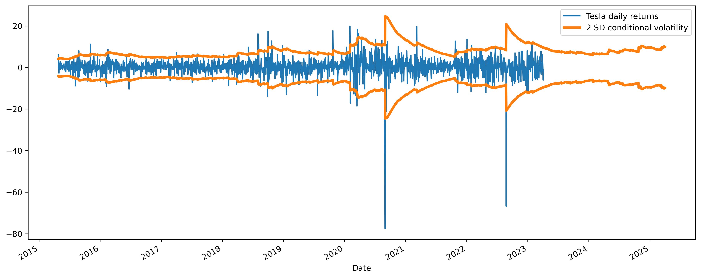
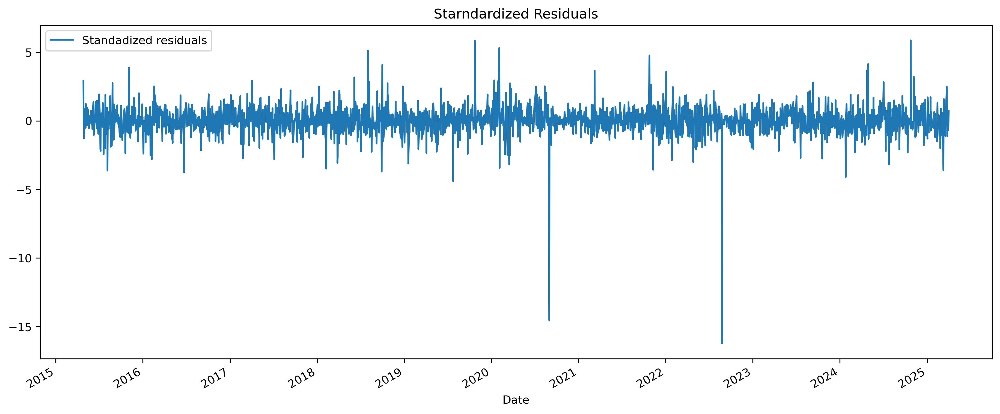
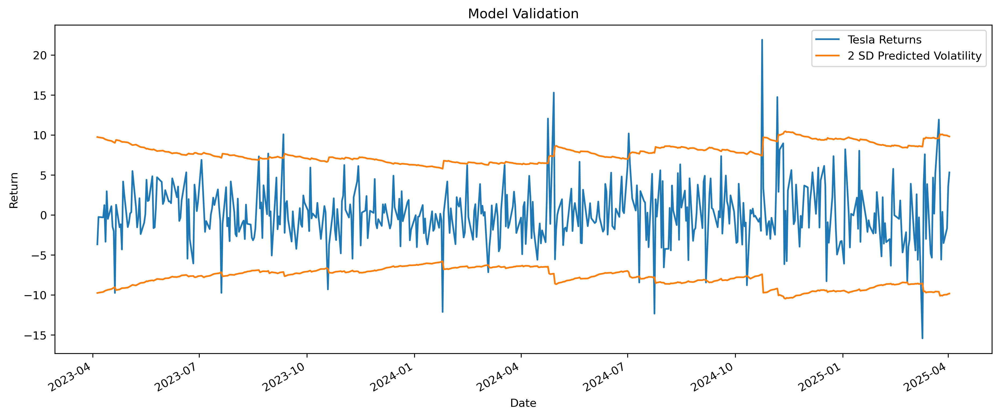

# **Tesla Stock Volatility Analysis (2015–2025)**  

This analysis examines Tesla’s stock returns, volatility patterns, and model performance using statistical and econometric techniques. Key findings are summarized below.  

---
# **Tesla Stock Volatility Analysis (2015–2025)**  

This analysis examines Tesla’s stock returns, volatility patterns, and model performance using statistical and econometric techniques. Key findings are summarized below.  

---
# **Tesla Stock Volatility Analysis (2015–2025)**  

This analysis examines Tesla’s stock returns, volatility patterns, and model performance using statistical and econometric techniques. Key findings are summarized below.  

---

## **1. Tesla vs. Ford Returns (2015–2025)**  
- **Tesla** exhibits extreme volatility (+20% to -80%), driven by:  
  - Growth stock dynamics, Elon Musk’s influence, and macroeconomic shocks.  
  - COVID-19 (2020) and Fed rate hikes (2022) caused severe swings.  
- **Ford** shows lower volatility (±20%), reflecting its stable, dividend-paying nature.  
- **Implication**: Tesla suits aggressive investors; Ford is better for risk-averse portfolios.  

---

## **2. Tesla Daily Returns Distribution**  
- **Fat-tailed, negatively skewed**:  
  - Frequent extreme losses (down to -80%) vs. fewer extreme gains.  
  - Non-normal distribution → GARCH models should use Student’s *t* or skewed distributions.  
- **Implication**: High risk of "black swan" events—tail-risk hedging (e.g., put options) is critical.  

---

## **3. 50-Day Rolling Volatility**  
- **Volatility regimes**:  
  - **Low (2015–2019)**: ~20–40%.  
  - **High (2020–2023)**: Spikes >60% (COVID, meme-stock mania, rate hikes).  
  - **Partial stabilization (2024–2025)**: Still elevated vs. pre-2020.  
- **Persistence (β ≈ 0.98 in GARCH)**: Volatility shocks decay slowly.  
- **Implication**: Momentum strategies work in high-volatility regimes; mean reversion in calm periods.  

---

## **4. Partial Autocorrelation (PACF)**  
- **Short-term momentum (Lags 1–5)**:  
  - Positive autocorrelation → trend-following strategies viable for 1–5 days.  
- **Weak long-term dependence**: No seasonal patterns beyond a week.  
- **Implication**: AR(1) or AR(5) models can capture short-term predictability.  

---

## **5. GARCH Model Results**  
- **Constant mean (μ)**: Insignificant (p=0.619) → no exploitable daily returns.  
- **GARCH(1,1) parameters**:  
  - **α (ARCH) = 0.019** → mild reaction to recent shocks.  
  - **β (GARCH) = 0.981** → extreme volatility persistence.  
- **Limitation**: Underestimates tail risks (use EGARCH or fat-tailed distributions).  

---

## **6. Conditional Volatility (2 SD Bands)**  
- **2020–2022**: Frequent breaches (±3 SD) due to unprecedented events.  
- **2023–2025**: Better fit but still misses extreme moves (e.g., AI hype in 2024).  
- **Implication**: Combine GARCH with regime-switching models for adaptive forecasting.  

---

## **7. Standardized Residuals**  
- **Extreme outliers (e.g., -15 to +5 SD)**:  
  - Cluster around crises (2008, 2020, 2022).  
  - Indicate model misspecification for tail events.  
- **Fix**: Use Extreme Value Theory (EVT) or hybrid ML-GARCH approaches.  

---

## **8. Model Validation (2023–2025)**  
- **2 SD bands capture ~90% of returns** → decent baseline fit.  
- **Weaknesses**:  
  - Underpredicts upside (e.g., +15% in 2024) and downside (e.g., -10% in 2024).  
  - Slow to adapt to new volatility regimes.  
- **Improvement**:  
  - Markov-Switching GARCH for regime detection.  
  - LSTM networks for non-linear volatility patterns.  

---

## **Key Takeaways**  
1. **Tesla is hyper-volatile**—tail-risk management is essential.  
2. **GARCH models work but need upgrades**:  
   - Fat tails (Student’s *t*), asymmetry (EGARCH), regime-switching.  
3. **Trading strategies**:  
   - Momentum (1–5 days) in high-volatility regimes.  
   - Tail hedging (options) during calm periods.  
4. **Future work**:  
   - Incorporate sentiment analysis (Elon’s tweets, news).  
   - Test machine learning hybrids (e.g., GARCH + Random Forests).  

--- 

**Conclusion**: Tesla’s stock is a prime example of how growth, speculation, and external shocks drive volatility. While statistical models provide a foundation, adaptive techniques are needed to navigate its extremes.  

*(Note: All analyses based on available data; exact parameters may vary with model specifications.)*
## **1. Tesla vs. Ford Returns (2015–2025)**  
- **Tesla** exhibits extreme volatility (+20% to -80%), driven by:  
  - Growth stock dynamics, Elon Musk’s influence, and macroeconomic shocks.  
  - COVID-19 (2020) and Fed rate hikes (2022) caused severe swings.  
- **Ford** shows lower volatility (±20%), reflecting its stable, dividend-paying nature.  
- **Implication**: Tesla suits aggressive investors; Ford is better for risk-averse portfolios.  

---

## **2. Tesla Daily Returns Distribution**  
- **Fat-tailed, negatively skewed**:  
  - Frequent extreme losses (down to -80%) vs. fewer extreme gains.  
  - Non-normal distribution → GARCH models should use Student’s *t* or skewed distributions.  
- **Implication**: High risk of "black swan" events—tail-risk hedging (e.g., put options) is critical.  

---

## **3. 50-Day Rolling Volatility**  
- **Volatility regimes**:  
  - **Low (2015–2019)**: ~20–40%.  
  - **High (2020–2023)**: Spikes >60% (COVID, meme-stock mania, rate hikes).  
  - **Partial stabilization (2024–2025)**: Still elevated vs. pre-2020.  
- **Persistence (β ≈ 0.98 in GARCH)**: Volatility shocks decay slowly.  
- **Implication**: Momentum strategies work in high-volatility regimes; mean reversion in calm periods.  

---

## **4. Partial Autocorrelation (PACF)**  
- **Short-term momentum (Lags 1–5)**:  
  - Positive autocorrelation → trend-following strategies viable for 1–5 days.  
- **Weak long-term dependence**: No seasonal patterns beyond a week.  
- **Implication**: AR(1) or AR(5) models can capture short-term predictability.  

---

## **5. GARCH Model Results**  
- **Constant mean (μ)**: Insignificant (p=0.619) → no exploitable daily returns.  
- **GARCH(1,1) parameters**:  
  - **α (ARCH) = 0.019** → mild reaction to recent shocks.  
  - **β (GARCH) = 0.981** → extreme volatility persistence.  
- **Limitation**: Underestimates tail risks (use EGARCH or fat-tailed distributions).  

---

## **6. Conditional Volatility (2 SD Bands)**  
- **2020–2022**: Frequent breaches (±3 SD) due to unprecedented events.  
- **2023–2025**: Better fit but still misses extreme moves (e.g., AI hype in 2024).  
- **Implication**: Combine GARCH with regime-switching models for adaptive forecasting.  

---

## **7. Standardized Residuals**  
- **Extreme outliers (e.g., -15 to +5 SD)**:  
  - Cluster around crises (2008, 2020, 2022).  
  - Indicate model misspecification for tail events.  
- **Fix**: Use Extreme Value Theory (EVT) or hybrid ML-GARCH approaches.  

---

## **8. Model Validation (2023–2025)**  
- **2 SD bands capture ~90% of returns** → decent baseline fit.  
- **Weaknesses**:  
  - Underpredicts upside (e.g., +15% in 2024) and downside (e.g., -10% in 2024).  
  - Slow to adapt to new volatility regimes.  
- **Improvement**:  
  - Markov-Switching GARCH for regime detection.  
  - LSTM networks for non-linear volatility patterns.  

---

## **Key Takeaways**  
1. **Tesla is hyper-volatile**—tail-risk management is essential.  
2. **GARCH models work but need upgrades**:  
   - Fat tails (Student’s *t*), asymmetry (EGARCH), regime-switching.  
3. **Trading strategies**:  
   - Momentum (1–5 days) in high-volatility regimes.  
   - Tail hedging (options) during calm periods.  
4. **Future work**:  
   - Incorporate sentiment analysis (Elon’s tweets, news).  
   - Test machine learning hybrids (e.g., GARCH + Random Forests).  

--- 

**Conclusion**: Tesla’s stock is a prime example of how growth, speculation, and external shocks drive volatility. While statistical models provide a foundation, adaptive techniques are needed to navigate its extremes.  

*(Note: All analyses based on available data; exact parameters may vary with model specifications.)*
## **1. Tesla vs. Ford Returns (2015–2025)**  
- **Tesla** exhibits extreme volatility (+20% to -80%), driven by:  
  - Growth stock dynamics, Elon Musk’s influence, and macroeconomic shocks.  
  - COVID-19 (2020) and Fed rate hikes (2022) caused severe swings.  
- **Ford** shows lower volatility (±20%), reflecting its stable, dividend-paying nature.  
- **Implication**: Tesla suits aggressive investors; Ford is better for risk-averse portfolios.  

---

## **2. Tesla Daily Returns Distribution**  
- **Fat-tailed, negatively skewed**:  
  - Frequent extreme losses (down to -80%) vs. fewer extreme gains.  
  - Non-normal distribution → GARCH models should use Student’s *t* or skewed distributions.  
- **Implication**: High risk of "black swan" events—tail-risk hedging (e.g., put options) is critical.  

---

## **3. 50-Day Rolling Volatility**  
- **Volatility regimes**:  
  - **Low (2015–2019)**: ~20–40%.  
  - **High (2020–2023)**: Spikes >60% (COVID, meme-stock mania, rate hikes).  
  - **Partial stabilization (2024–2025)**: Still elevated vs. pre-2020.  
- **Persistence (β ≈ 0.98 in GARCH)**: Volatility shocks decay slowly.  
- **Implication**: Momentum strategies work in high-volatility regimes; mean reversion in calm periods.  

---

## **4. Partial Autocorrelation (PACF)**  
- **Short-term momentum (Lags 1–5)**:  
  - Positive autocorrelation → trend-following strategies viable for 1–5 days.  
- **Weak long-term dependence**: No seasonal patterns beyond a week.  
- **Implication**: AR(1) or AR(5) models can capture short-term predictability.  

---

## **5. GARCH Model Results**  
- **Constant mean (μ)**: Insignificant (p=0.619) → no exploitable daily returns.  
- **GARCH(1,1) parameters**:  
  - **α (ARCH) = 0.019** → mild reaction to recent shocks.  
  - **β (GARCH) = 0.981** → extreme volatility persistence.  
- **Limitation**: Underestimates tail risks (use EGARCH or fat-tailed distributions).  

---

## **6. Conditional Volatility (2 SD Bands)**  
- **2020–2022**: Frequent breaches (±3 SD) due to unprecedented events.  
- **2023–2025**: Better fit but still misses extreme moves (e.g., AI hype in 2024).  
- **Implication**: Combine GARCH with regime-switching models for adaptive forecasting.  

---

## **7. Standardized Residuals**  
- **Extreme outliers (e.g., -15 to +5 SD)**:  
  - Cluster around crises (2008, 2020, 2022).  
  - Indicate model misspecification for tail events.  
- **Fix**: Use Extreme Value Theory (EVT) or hybrid ML-GARCH approaches.  

---

## **8. Model Validation (2023–2025)**  
- **2 SD bands capture ~90% of returns** → decent baseline fit.  
- **Weaknesses**:  
  - Underpredicts upside (e.g., +15% in 2024) and downside (e.g., -10% in 2024).  
  - Slow to adapt to new volatility regimes.  
- **Improvement**:  
  - Markov-Switching GARCH for regime detection.  
  - LSTM networks for non-linear volatility patterns.  

---

## **Key Takeaways**  
1. **Tesla is hyper-volatile**—tail-risk management is essential.  
2. **GARCH models work but need upgrades**:  
   - Fat tails (Student’s *t*), asymmetry (EGARCH), regime-switching.  
3. **Trading strategies**:  
   - Momentum (1–5 days) in high-volatility regimes.  
   - Tail hedging (options) during calm periods.  
4. **Future work**:  
   - Incorporate sentiment analysis (Elon’s tweets, news).  
   - Test machine learning hybrids (e.g., GARCH + Random Forests).  

--- 

**Conclusion**: Tesla’s stock is a prime example of how growth, speculation, and external shocks drive volatility. While statistical models provide a foundation, adaptive techniques are needed to navigate its extremes.  