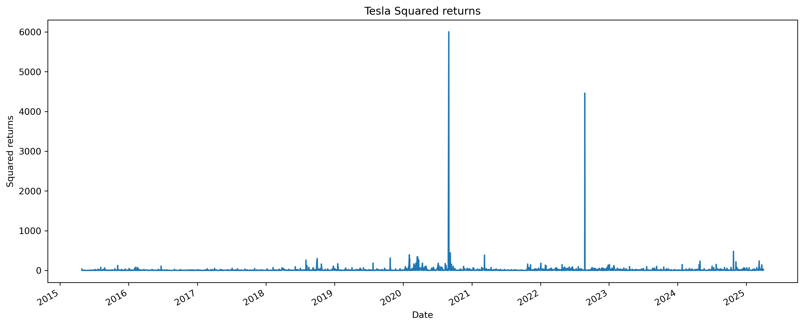

# Stock Volatility Forecasting with GARCH Models

## Overview

This project provides an end-to-end solution for collecting stock market data, building GARCH (Generalized Autoregressive Conditional Heteroskedasticity) models for volatility forecasting, and deploying these models via a FastAPI web service. The system implements a complete ETL pipeline and offers RESTful endpoints for model training and prediction.

## Table of Contents

- [Stock Volatility Forecasting with GARCH Models](#stock-volatility-forecasting-with-garch-models)
  - [Overview](#overview)
  - [Table of Contents](#table-of-contents)
  - [Features](#features)
  - [Project Structure](#project-structure)
  - [ETL Pipeline](#etl-pipeline)
  - [GARCH Modeling](#garch-modeling)
    - [Model Implementation](#model-implementation)
    - [Training Process](#training-process)
  - [Case Study: Tesla Volatility Analysis (2015-2025)](#case-study-tesla-volatility-analysis-2015-2025)
    - [Key Findings](#key-findings)
    - [Practical Implications](#practical-implications)
  - [Model Performance Evaluation](#model-performance-evaluation)
    - [Understanding Model Metrics](#understanding-model-metrics)
    - [Optimization Tips](#optimization-tips)
  - [API Documentation](#api-documentation)
    - [Key Endpoints](#key-endpoints)
  - [Getting Started](#getting-started)
    - [Prerequisites](#prerequisites)
    - [Installation](#installation)
    - [Running the Application](#running-the-application)
  - [Configuration](#configuration)
  - [Dependencies](#dependencies)

## Features

- Automated data collection from Alpha Vantage API
- SQLite database integration for data persistence
- GARCH model training and volatility forecasting
- REST API with FastAPI for easy integration
- Comprehensive error handling and validation
- Model persistence and caching
- Ticker verification across global markets

## Project Structure

```
project/
│
├── app/
│   ├── __init__.py           # Make it a package
│   ├── main.py               # FastAPI application
│   ├── models.py             # Data models
│   ├── etl.py                # ETL process implementation
│   ├── garch_model.py        # GARCH model building and prediction
│   ├── config.py             # Configuration settings
│   ├── data.py               # Data handling classes (SQLRepository, AlphaVantageAPI)
│   └── settings.py           # Additional settings (if needed)
│
├── .env                       # Environment variables
├── requirements.txt           # Python dependencies
└── README.md                  # Project documentation
```

## ETL Pipeline

The data processing workflow:

1. **Extraction**:
   - Fetch stock data from Alpha Vantage API
   - Support for multiple endpoints (daily, intraday, etc.)
   - Automatic rate limiting handling

2. **Transformation**:
   - Data cleaning and normalization
   - Calculation of daily returns
   - Outlier detection and handling
   - Stationarity checks

3. **Loading**:
   - SQLite database storage with SQLAlchemy ORM
   - Data versioning and updates
   - Efficient querying for model training

## GARCH Modeling

### Model Implementation

- Supports GARCH(p,q) with configurable parameters
- Automatic model selection based on AIC/BIC
- Residual analysis and model diagnostics
- Volatility forecasting capabilities

### Training Process

1. Data preparation and stationarity checks
2. Parameter estimation via maximum likelihood
3. Model validation and backtesting
4. Serialization for future use

## Case Study: Tesla Volatility Analysis (2015-2025)

### Key Findings

1. **Extreme Volatility Characteristics**
   - Daily returns range from +20% to -80%
   - Fat-tailed, negatively skewed distribution
   - 50-day rolling volatility spikes >60% during market crises

2. **GARCH Model Insights**
   - High persistence (β = 0.981)
   - Significant ARCH effects (α = 0.019)
   - Constant mean not statistically significant

3. **Temporal Patterns**
   - 2020-2022: Extreme volatility (COVID, meme-stock era)
   - 2023-2025: Partial stabilization but remains elevated

4. **Model Limitations**
   - Underpredicts tail risks (black swan events)
   - Slow to adapt to regime changes
   - Normal distribution assumption violated

### Practical Implications

1. **For Traders**
   - Momentum strategies effective in high-volatility regimes
   - Tail-risk hedging crucial (put options)
   - Caution during earnings/Elon Musk tweet periods

2. **For Model Improvement**
   - Implement fat-tailed distributions (Student's t)
   - Add asymmetric volatility (EGARCH/GJR-GARCH)
   - Incorporate regime-switching capabilities

3. **Key Statistics**
   | Metric | Value |
   |---|---|
   | Max Daily Return | +20% |
   | Min Daily Return | -80% |
   | Avg 50-day Volatility | 40-60% |
   | GARCH Persistence (β) | 0.981 |



*Complete analysis available in [ANALYSIS.md](ANALYSIS.md)*

## Model Performance Evaluation

### Understanding Model Metrics
When training a GARCH model, you'll receive AIC and BIC metrics:

```json
{
  "ticker": "IBM",
  "n_observations": 2000,
  "use_new_data": true,
  "p": 1,
  "q": 1,
  "success": true,
  "message": "Trained and saved 'models/IBM.pkl'. Metrics: AIC 7310.51, BIC 7332.91"
}
```

- **AIC (Akaike Information Criterion)**: Lower values indicate better model fit (accounts for complexity)
- **BIC (Bayesian Information Criterion)**: Similar to AIC but with stronger penalty for complex models

### Optimization Tips
- Compare different (p,q) parameter combinations
- Try larger sample sizes with `n_observations`
- Consider alternative models (EGARCH, GJR-GARCH) for asymmetric volatility

## API Documentation

The FastAPI application provides automatic documentation at `/docs` and `/redoc` endpoints.

### Key Endpoints

**1. Model Training (`/fit`)**
```bash
curl -X POST "http://localhost:8000/fit" \
-H "Content-Type: application/json" \
-d '{
  "ticker": "IBM",
  "n_observations": 2000,
  "use_new_data": true,
  "p": 1,
  "q": 1
}'
```

**2. Volatility Prediction (`/predict`)**
```bash
curl -X POST "http://localhost:8000/predict" \
-H "Content-Type: application/json" \
-d '{
  "ticker": "IBM",
  "n_days": 5,
  "return_volatility": true,
  "annualize": false
}'
```

**3. Ticker Verification (`/check_ticker`)**
```bash
curl -X POST "http://localhost:8000/check_ticker" \
-H "Content-Type: application/json" \
-d '{"ticker": "tesla"}'
```

**4. Data Validation (`/data/{ticker}`)**
```bash
curl "http://localhost:8000/data/IBM"
```

## Getting Started

### Prerequisites

- Python 3.8+
- Alpha Vantage API key
- SQLite (or other database)

### Installation

1. Clone the repository:
   ```bash
   git clone https://github.com/yourusername/stock-volatility.git
   cd stock-volatility
   ```

2. Set up virtual environment:
   ```bash
   python -m venv venv
   source venv/bin/activate  # On Windows: venv\Scripts\activate
   ```

3. Install dependencies:
   ```bash
   pip install -r requirements.txt
   ```

4. Configure environment variables (see below)

### Running the Application

Start the FastAPI server:
```bash
uvicorn app.main:app --reload
```

Access the API at `http://localhost:8000`

## Configuration

Create a `.env` file with the following variables:

```ini
# API Configuration
alpha_api_key="your_api_key_here"
db_name=sqlite:///./data/volatility.db
model_directory=./models
```

## Dependencies

Main requirements:
- FastAPI
- Uvicorn
- SQLAlchemy
- Pandas
- NumPy
- Arch
- Requests
- Python-dotenv
